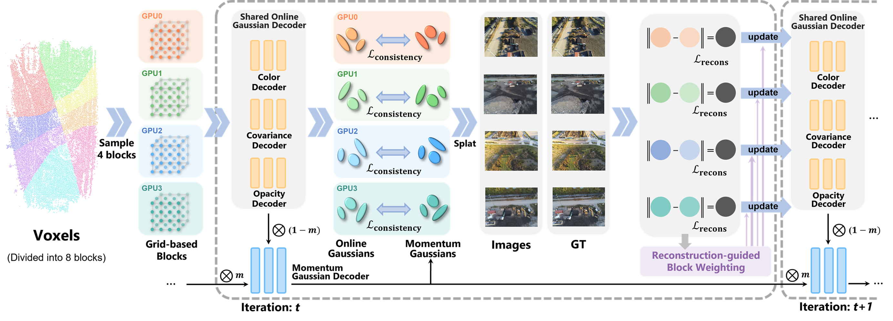

# Momentum-GS: Momentum Gaussian Self-Distillation for High-Quality Large Scene Reconstruction

[Jixuan Fan*](https://jixuan-fan.github.io/), [Wanhua Li*](https://li-wanhua.github.io/), Yifei Han, [Yansong Tang#](https://andytang15.github.io/)

**[[Project Page](https://github.com/Jixuan-Fan/Momentum-GS_Page)] | [[Paper]()]**

3D Gaussian Splatting has demonstrated notable success in large-scale scene reconstruction, but challenges persist due to high training memory consumption and storage overhead.
Hybrid representations that integrate implicit and explicit features offer a way to mitigate these limitations.
However, when applied in parallelized block-wise training, two critical issues arise since reconstruction accuracy deteriorates due to reduced data diversity when training each block independently, and parallel training restricts the number of divided blocks to the available number of GPUs.
To address these issues, we propose Momentum-GS, a novel approach that leverages momentum-based self-distillation to promote consistency and accuracy across the blocks while decoupling the number of blocks from the physical GPU count.
Our method maintains a teacher Gaussian decoder updated with momentum, ensuring a stable reference during training. This teacher provides each block with global guidance in a self-distillation manner, promoting spatial consistency in reconstruction.
To further ensure consistency across the blocks, we incorporate block weighting, dynamically adjusting each block’s weight according to its reconstruction accuracy.
Extensive experiments on large-scale scenes show that our method consistently outperforms existing techniques, achieving a 12.8\% improvement in LPIPS over CityGaussian with much fewer divided blocks and establishing a new state of the art.

# 📰 News
**[2024.12]** We release the code.

# 📝 TODO
- [ ] Release pretrained checkpoints.
- [ ] Provide guidance to divide scene into arbitrary blocks.
- [ ] Add appearance modeling.

# 🏙️ Overview

Our method begins by dividing the scene into multiple blocks (left), periodically sampling a subset of blocks (e.g., 4 blocks) and assigning them to available GPUs for parallel processing. The momentum Gaussian decoder provides stable global guidance to each block, ensuring consistency across blocks. To align the online Gaussians with the momentum Gaussian decoder, a consistency loss is applied. During splatting, predicted images are compared with ground truth images, and the resulting reconstruction loss is used to update the shared online Gaussian decoder. Additionally, reconstruction-guided block weighting dynamically adjusts the emphasis on each block, prioritizing underperforming blocks to enhance overall scene consistency.


# 🛠️ Installation

The following guidance works well for a machine with GeForce RTX 3090 GPU, CUDA 11.8 / 11.7, Pytorch 2.3.1 / 1.13.1 

### 1. Clone the repo

```bash
git clone https://github.com/Jixuan-Fan/Momentum-GS.git
cd Momentum-GS
```

### 2. Create environment
```bash
SET DISTUTILS_USE_SDK=1 # Windows only
conda env create --file environment.yml
conda activate momentum-gs
```
Alternatively, you can create the environment manually.

(1) Create conda environment 
```bash
conda create -n momentum-gs python=3.8 -y
conda activate momentum-gs
```
(2) Install pytorch
```bash
conda install pytorch==2.3.1 torchvision==0.18.1 torchaudio==2.3.1 pytorch-cuda=11.8 -c pytorch -c nvidia -y
```

(3) Install dependencies
```bash
pip install plyfile==0.8.1 tqdm einops wandb lpips laspy colorama jaxtyping opencv-python matplotlib ipykernel torch_scatter submodules/diff-gaussian-rasterization submodules/simple-knn
```


# 💻 Usage

The following steps are structured in order.

## 📷 Prepare data

Please see [prepare_data.md](docs/prepare_data.md) for installation instructions. 


## 📈 Training
We train our Momentum-GS on GeForce RTX 3090, 24G VRAM is enough for default setting.

To train our ManiGaussian without semantic features and deformation predictor (the fastest version), run:
```bash
bash scripts/train_and_eval_w_geo.sh ManiGaussian_BC 0,1 12345 ${exp_name}
```


## 📊 Evaluation
To evaluate the checkpoint, you can use:
```bash
bash scripts/eval.sh ManiGaussian_BC ${exp_name} 0
```
**NOTE**: The performances on `push_buttons` and `stack_blocks` may fluctuate slightly due to different variations.


# 🏷️ License
This repository is released under the MIT license.

# 🙏 Acknowledgement

Our code is built upon [3D-GS](https://github.com/graphdeco-inria/gaussian-splatting),  [Scaffold-GS](https://github.com/city-super/Scaffold-GS), and [CityGaussian](https://github.com/DekuLiuTesla/CityGaussian). We thank all these authors for their nicely open sourced code and their great contributions to the community.

# 🥰 Citation
If you find this repository helpful, please consider citing:

```
# Waiting for Google Scholar update
```