# Developing Harder

## Reference Code Reading

### [EWA Volume Splatting](https://ieeexplore.ieee.org/document/964490)

The basis equation for all spaltting algorithms:
```math
\begin{align}
    I_{\lambda}(\hat{\mathbf{x}}) &= \sum_k c_{\lambda k}(\hat{\mathbf{x}}) g_k q_k (\hat{\mathbf{x}}) \prod_{j=0}^{k-1}(1 - g_j q_j(\hat{\mathbf{x}})) \\
    q_k(\hat{\mathbf{x}}) &= \int_{\mathbb{R}} r_k (\hat{\mathbf{x}}, x_2) dx_2
\end{align}
```
where,
- $\hat{\mathbf{x}} = (x_0, x_1)^T$ and $\mathbf{x} = (\hat{\mathbf{x}}, x_2)^T$ along the viewing ray, $\hat{\mathbf{x}}$ is called *screen coordinates*.
- $c_{\lambda}$ is an emmision coefficient
- $g_k$ is the weighted sum of reconstruction kernel $r_k(\mathbf{x})$
- $q_k$ is the **footprint function**, which is the itegrated reconstruction kernels.

Note that $I_{\lambda}(\hat{\mathbf{x}})$ is continuous. This function will be band-limited before sampled into sampling grid. The band-limitation is achieved by convolving $I_{\lambda}(\hat{\mathbf{x}})$ with a low-pass filter $h(\hat{\mathbf{x}})$.
```math
(I_{\lambda} \otimes h)(\hat{\mathbf{x}}) = \int_{\mathbb{R}^2} \sum_k c_{\lambda k}(\eta) g_k q_k (\eta) \prod_{j=0}^{k-1}(1 - g_j q_j(\eta)) h(\hat{\mathbf{x}} - \eta) d\eta
```

**EWA Splatting** assumes that:
- $c_{\lambda k}(\hat{\mathbf{x}}) \approx c_{\lambda k}$, ignoring the effect of shading for anti-aliasing.
- $\prod_{j=0}^{k-1}(1 - g_j q_j(\hat{\mathbf{x}})) \approx o_k$, ignoring the edge anti-aliasing.

Therefore, Equation (3) can be re-written as:
```math
\begin{align}
    (I_{\lambda} \otimes h)(\hat{\mathbf{x}}) &\approx \sum_k c_{\lambda k} o_k g_k \int_{\mathbb{R}^2} q_k (\eta) h(\hat{\mathbf{x}} - \eta) d\eta \\
    &= \sum_k c_{\lambda k} o_k g_k (q_k \otimes h)(\hat{\mathbf{x}})
\end{align}
```
Following Heckbert's terminology, we call:
```math
\rho_k(\hat{\mathbf{x}}) = (q_k \otimes h) (\hat{\mathbf{x}})
```

> **This means that instead of band-liming $I_{\lambda}(\hat{\mathbf{x}})$ directly, we band-limit each footprint function.** \
> **EWA Splatting, a.k.a Gaussian Splating, is to compute the footprint function $q_k(\hat{\mathbf{x}})$ and $rho_k(\hat{\mathbf{x}})$ using Gaussian kernels.**

Define elliptical Gaussian kernel as:
```math
% \mathcal{G}_V(\Phi^{-1}(\mathbf{u}) -\mathbf{p}) = \frac{1}{\vert M^{-1} \vert} \mathcal(G)_{MVM^T}(\mathbf{u} - \Phi(\mathbf{p}))
\mathcal{G}_V (\mathbf{x} - \mathbf{p}) = \frac{1}{2\pi \vert V \vert^{\frac{1}{2}}} e^{-\frac{1}{2} (\mathbf{x} - \mathbf{p})^T V^{-1} (\mathbf{x} - \mathbf{p})}
```
where, $V$ is the covariance matrix, $\mathbf{p}$ is the mean vector, and $\vert V \vert$ is the determinant of $V$.
```
Define Gaussian kernels in object space by $r_{k}^{\prime\prime} = \mathcal{G}_{V_k^{\prime\prime}}(\mathbf{t} - \mathbf{t}_k)$. Viewing Transformation of 3D Gaussian kernel with affine transformation $\mathbf{u} = \varphi (\mathbf{t})$:
```math
\mathcal{G}_{V_k^{\prime\prime}}(\varphi^{-1} (\mathbf{u}) - \mathbf{t}_k) = \frac{1}{\vert M_k^{-1} \vert} \mathcal{G}_{V_k^{\prime}}(\mathbf{u} -  \mathbf{u}_k) = r_k^{\prime} (\mathbf{u})
```
where, $V_k^{\prime} = W V_k W^T$.

Since Projective Transformation is non-linear, local affine approximation is used with Jacobian matrix. $\mathbf{m}_{\mathbf{u}_k} (\mathbf{u}) = \mathbf{x}_k + \mathbf{J}_{\mathbf{u}_k} \cdot (\mathbf{u} - \mathbf{u}_k)$. Therefore,
```math
\begin{align}
    r_k(\mathbf{x}) &= \frac{1}{\vert W^{-1} \vert \vert J^{-1} \vert} \mathcal{G}_{V_k} (\mathbf{x} - \mathbf{x}_k) \\
    V_k &= J V_k^{\prime} J^T = J W V_k^{\prime\prime} W^T J^T
\end{align}
```
Integration and Band-limiting can be inpreted as:
```math
q_k(\hat{\mathbf{x}}) = \frac{1}{\vert J^{-1} \vert \vert W^{-1} \vert} \mathcal{G}_{\hat{V}_k} (\hat{\mathbf{x}} - \hat{\mathbf{x}}_k)
```
and
```math
\rho_k(\hat{\mathbf{x}}) = \frac{1}{\vert J^{-1} \vert \vert W^{-1} \vert} \mathcal{G}_{\hat{V}_k + V^h} (\hat{\mathbf{x}} - \hat{\mathbf{x}}_k)
```


### [GussianSR](https://arxiv.org/abs/2407.18046)

No public repository available. The pseudocode is offered as follow.

> **Algorithm 1** A Simple Example of 2D Gaussian Splatting \
> **Require**: $\Sigma_x$, $\Sigma_y$, $\rho$ (covariance param), $coords$ (point coordinates), $color$ (point colors), $image\,size$ \
> **Ensure**: $final\,image$ (rendered image) \
> 1: Compute the covariance matrix $\Sigma$ using $\Sigma_x$, $\Sigma_y$, and $\rho$ \
> 2: Check if $\Sigma$ is positive definite \
> 3: Compute the inverse of $\Sigma$: $\Sigma^{-1}$ \
> 4: Create a 2D grid $x, y$ in the range $[-5, 5]$ \
> 5: Compute the Gaussian kernel $K$ using $x, y$, and $\Sigma^{-1}$ \
> 6: Normalize $K$ to $[0, 1]$ range \
> 7: Repeat $K$ along the channel dimension to match colors \
> 8: Pad $K$ with zeros to match $image\,size$ \
> 9: Create a batch of 2D affine transformation matrices $\Theta$ using $coords$ \
> 10: Apply affine transformations to $K$ using $\Theta$ to obtain $K_{translated}$ \
> 11: Multiply $K_{translated}$ with $color$ to get image layers \
> 12: Sum the image layers to obtain $final\,image$ \
> 13: Clamp $final\,image$ to $[0, 1]$ range \
> 14: Permute $final\,image$ to match the channel order \
> **Return** $final\,image$


## Exploration Experiments

### Data Processing

The MatrixCity block A is composed of totally `1063` **aerial** frames and `4075` **street** frames. The total number of the entire MatrixCity SfM points is `3826641`. 

<!-- The entire MatrixCity points         |  Camera trajectory of MatrixCity block A
:-----------------------------------:|:-----------------------------------------: -->
<!--   |   -->
<p align="center">
    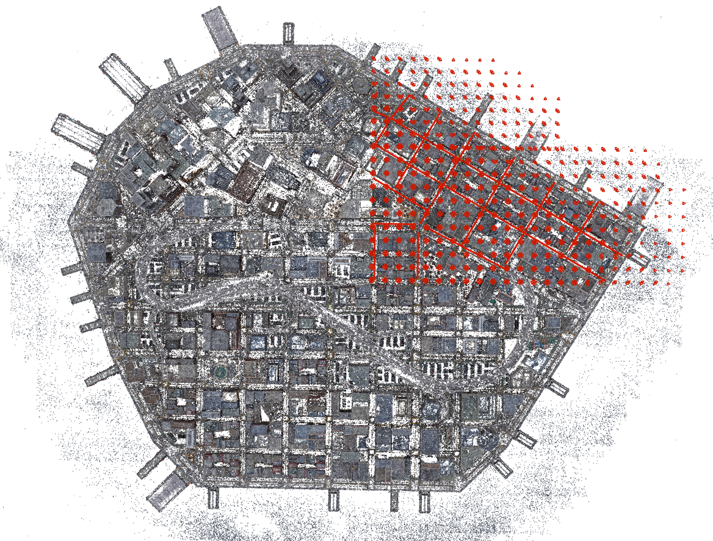 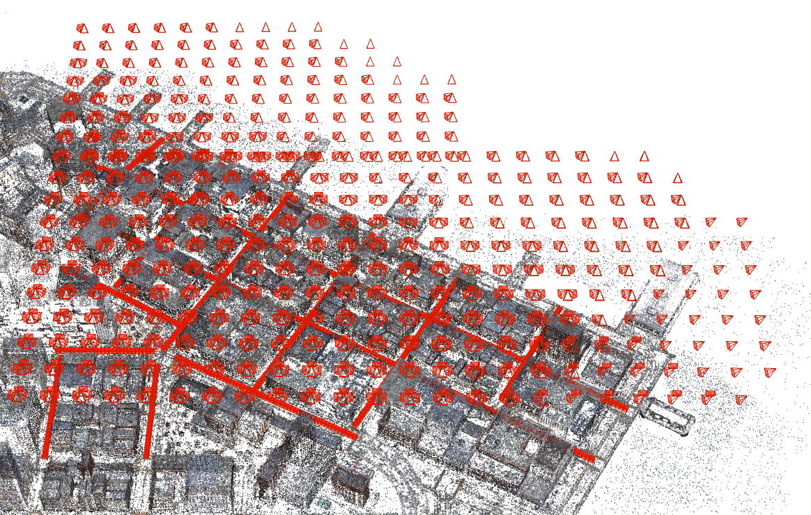 
</p>

To extract a small port of data for the convenience of development, we select a square area of the MatrixCity block A, which is shown as follows.

<!--  -->
<p align="center">
    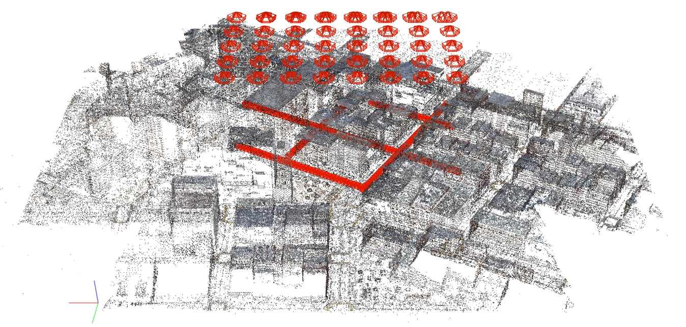
</p>

The selected region contains totally `1229` frames, detailed below
- **aerial**: `189` frames
- **street**: `1040` frames
- **SfM points**: `760348` points

### 3D Model Preacquisition

- **Whole City**: stored in `outputs/pretrianed/matrixcity/point_cloud/iteration_60000`
- **City Block A area**: stored in `outputs/pretrianed/matrixcity/point_cloud/iteration_60000_blockA_aera`
- **City Block A area with street**: stored in `outputs/bdaibdai___MatrixCity/small_city/blockA_fusion_small/train/mc-1gpu-smallaera-densification80kiter/2024-12-25_19:14:01/point_cloud/iteration_100000`

To visualize the rendering results on both aerial and street views, we run the $3$ models on the same test set. Figure below shows the rendering images.
<p align="center">
    <!-- <video width="320" height="240" controls>
    <source src="../assets/compare.mp4" type="video/mp4">
    </video> -->
    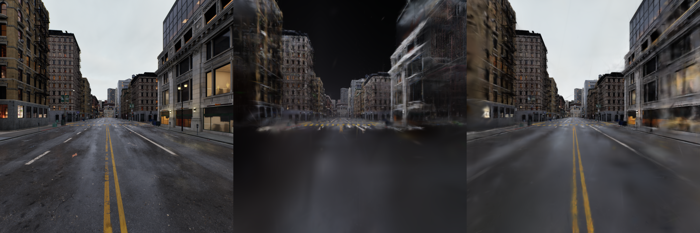
</p>

**NOTE:**
- **Whole City** model cannot generate densed gaussian kernels to represent the street view. Sparcity prevent rendering high quality images.
- **City Block A area with street** model performs better than the others, but one can still observe blurry, or aliasing, or blank holes in the images. 

This further proves a densify method (either SR or Densification) is necessary to improve the overall rendering quality.

### Potential of "Interpolation"

> **Key Idea**: Interpolate in the continuous field, and reflect to the discrete field.\
> **Meaning**: Bridge the gap between the continuous and discrete field, with hand-crafted function or anything.

It's worth noting that *EWA Splatting* take a low-pass filter to band-limit the continuous function $I_{\lambda}(\hat{\mathbf{x}})$. 

In practice, Gaussian Splatting footprint sampling rate is affected by multiple factors. It may not necessarily follow the **Nyquist-Shannon Sampling Frequency**.
- **Low initial sampling rate**: The initalization (a.k.a SfM) being too sparse can cause the missing necessary details. The recovered signal through such sparse sampled data may not be accurate. (**City Block A area with street** is the case).
- **Low image sampling rate**: Image resolution also plays a key role in the high frequency components of Gaussian kernels. Upsampling works under such situation. (Gaussian Super Resolution are the case).
- **Low Densification exploration rate**: Densification works as an upsampling method, e.g. Split & Clone. When the image sampling rate and inital sampling rate are low, high exploration rate is necessary to guess the missing frequancy components. (may not be accurate, but visually persuasive).

As the original implementation takes Scaffold-gs as the reconstruction base, we can consider the interpolation from feature field for high frequency recovery.

To visualize the characteristics of the discrete feature field, we plot the feature Gaussian kernels along with the color Gaussian kernels to find the possible continuous representation of the field.

*In the figure below,  the left image is `gt` and the right image is `color Gaussian kernels`.*
<p align="center">
    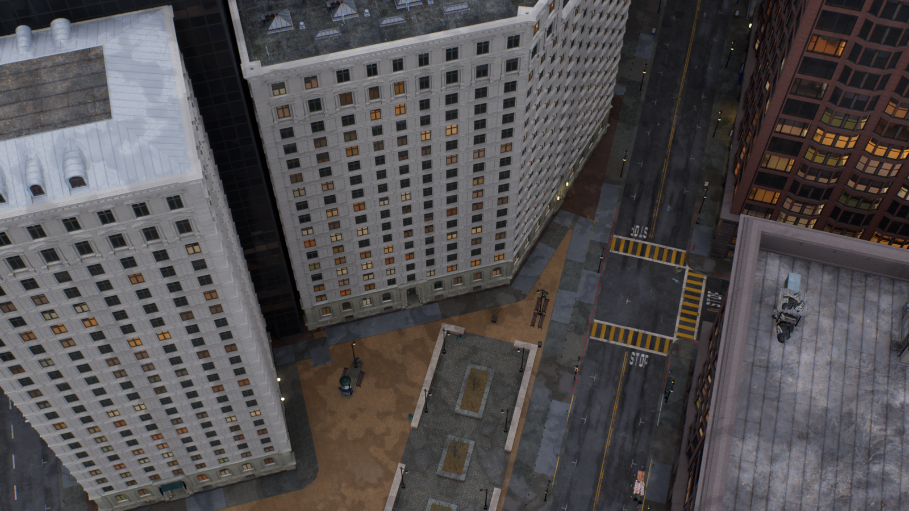 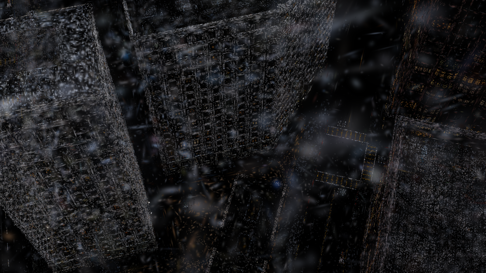 
</p>

*In the figure below, totally `32` images represent the `32` channels of the feature Gaussian kernels.*
<p align="center">
    
</p>

Both high frequency and low frequency components are observed in the feature Gaussian kernels. The high frequency components are mainly distributed in the edge areas, while the low frequency components are distributed in the flat areas.

One possible way to do the interpolation with discrete feature field is to use the normal distribution to smooth the discrete field. The following figures show the main idea.
<p align="center">
    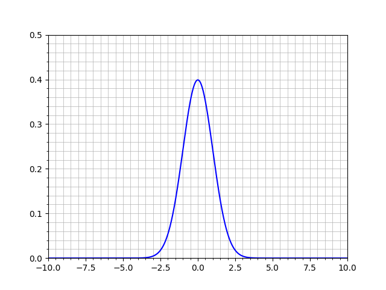 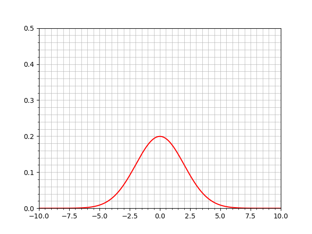 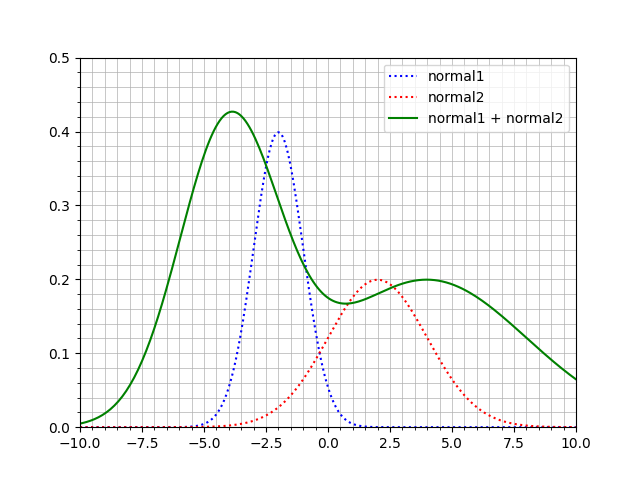
</p>
where, `grid` denotes the sampling grid.

Whenever two Gaussian kernels overlap, we first compute the probability of the intersection area as,
```math
\begin{align*}
    P_{\text{intersection}} &= \int_{\mathbb{R}^2} \mathcal{N}(\mathbf{x} | \mathbf{m}_1, \Sigma_1) \mathcal{N}(\mathbf{x} | \mathbf{m}_2, \Sigma_2) d\mathbf{x} \\
    &= \frac{1}{2\pi \sqrt{\vert \Sigma_1 + \Sigma_2 \vert}} \exp \left( -\frac{1}{2} (\mathbf{m}_1 - \mathbf{m}_2)^T (\Sigma_1 + \Sigma_2)^{-1} (\mathbf{m}_1 - \mathbf{m}_2) \right)
\end{align*}
```
Then, we compute the probability of the union area as,
```math
\begin{align*}
    P_{\text{union}} &= \int_{\mathbb{R}^2} \mathcal{N}(\mathbf{x} | \mathbf{m}_1, \Sigma_1) + \mathcal{N}(\mathbf{x} | \mathbf{m}_2, \Sigma_2) - \mathcal{N}(\mathbf{x} | \mathbf{m}_1, \Sigma_1) \mathcal{N}(\mathbf{x} | \mathbf{m}_2, \Sigma_2) d\mathbf{x} \\
    &= \frac{1}{2\pi \sqrt{\vert \Sigma_1 + \Sigma_2 \vert}} \left( 1 + \exp \left( -\frac{1}{2} (\mathbf{m}_1 - \mathbf{m}_2)^T (\Sigma_1 + \Sigma_2)^{-1} (\mathbf{m}_1 - \mathbf{m}_2) \right) \right)
\end{align*}
```

Pre-defined threshold $\tau$ is used to determine the interpolation area. If $P_{\text{intersection}} > \tau$, we interpolate the feature field with the union probability $P_{\text{union}}$.


### High Pass Fitler for frequency increase

As `self._scaling` is composed of `[:, :3]` and `[:, 3:]`, controlling the offset scales and the gaussian scales. Use high pass filter on either of them, or both, can remove the uncertain large kernels (low frequency) and add up the small kernels (high frequency).

Visual fitlering results are shown below.
<p align="center">
    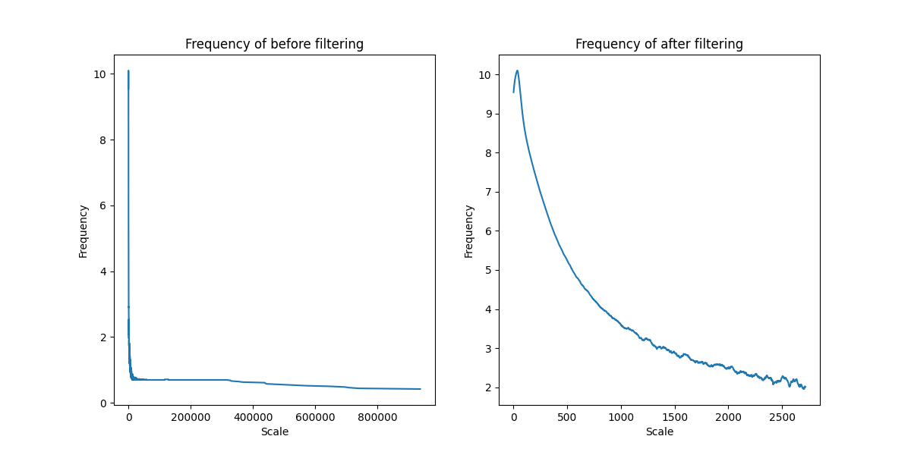 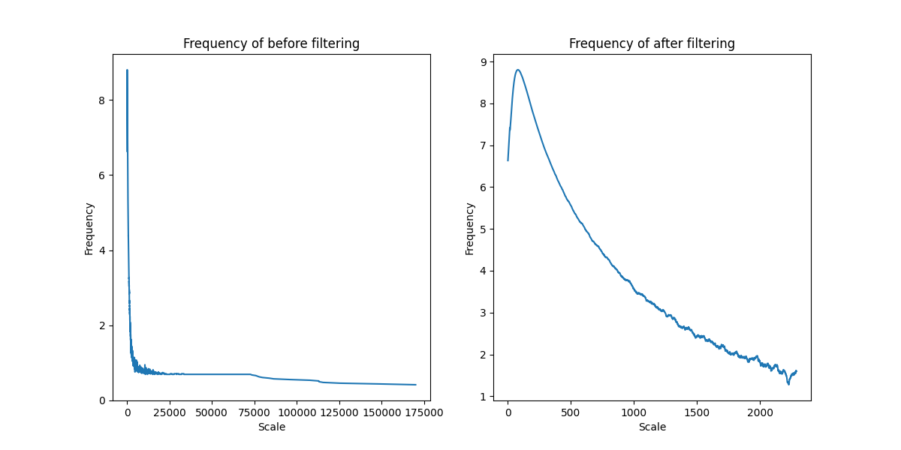
</p>
Left is the offset scale, and right is the gaussian scale. 

After fitlering, high frequency points are added with gt depth map. The process can be viewed as below.
<p align="center">
    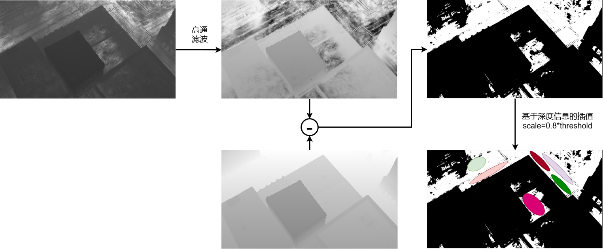 
</p>

### Adding a small portion of street

```python
# To be selected
[1171, 1192]
[1148, 1502]
[2012, 2025, 2049, 2072]
[3840, 3857]
[3780, 3799, 3813]
[3714, 3731]
[3641, 3665, 3682]
[3564]
[3516, 3528]
[3461]
[3395, 3406]
[3351]
[3104]
[3091, 3102]
[3024, 3048]
[2984, 3022]
[2505, 2529, 2553]
[2331, 2351, 2374, 2394]
[2188, 2211, 2234]
[2024, 2048, 2072]
```

### Think how to make the most of Features (discrete features to continuous field)
